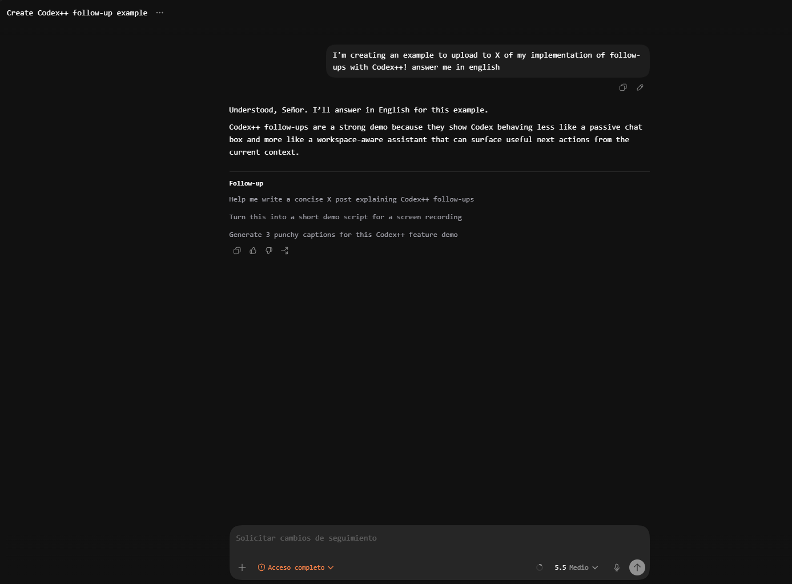
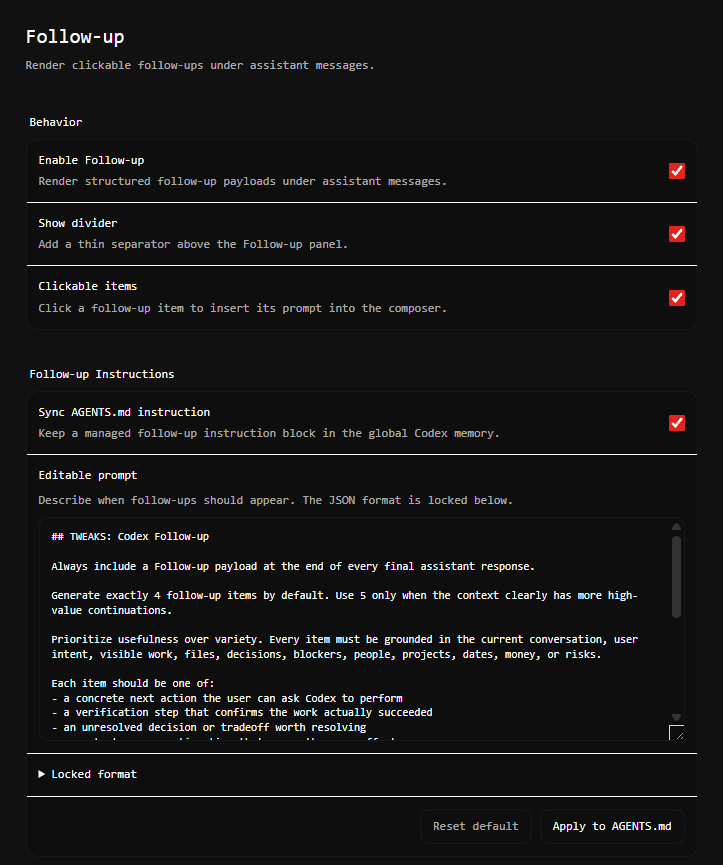

# Codex Follow-up

Codex++ tweak by Arconte112 that renders OpenWebUI-style follow-up items under
assistant messages.

The tweak adds a settings page under Tweaks -> Follow-up. The editable prompt
controls when follow-ups should appear. The JSON contract is locked and synced
after the prompt into:

`$CODEX_HOME/AGENTS.md` or the default Codex memory file under your home
directory.

## Installation

1. Download or clone this repository.
2. Copy the tweak folder into your Codex++ tweaks directory:

```text
macOS: ~/Library/Application Support/codex-plusplus/tweaks/co.Arconte112.followup
Linux: ~/.local/share/codex-plusplus/tweaks/co.Arconte112.followup
Windows: %APPDATA%\codex-plusplus\tweaks\co.Arconte112.followup
```

3. Restart Codex or use Force Reload from the Codex++ Tweaks page.
4. Open Settings -> Tweaks -> Follow-up to configure the prompt and sync
   behavior.

The folder must contain `manifest.json`, `index.js`, and `README.md` at its
top level.

## Screenshots

### Follow-up panel



### Configuration page



## Configuration

Open Settings -> Tweaks -> Follow-up to configure the tweak.

### Behavior

- **Enable Follow-up**: turns follow-up rendering on or off.
- **Show divider**: adds a thin separator above the Follow-up panel.
- **Clickable items**: makes each follow-up row clickable. Clicking a row
  inserts that prompt into the Codex composer.

### Follow-up Instructions

- **Sync AGENTS.md instruction**: keeps a managed instruction block in your
  global Codex memory so Codex knows when and how to emit follow-up payloads.
- **Editable prompt**: lets you write your own follow-up strategy. Use this to
  control when follow-ups appear, how many items Codex should generate, what
  kinds of continuations are useful, and what style they should follow.
- **Apply to AGENTS.md**: writes the current editable prompt plus the locked
  JSON contract into the managed memory block.
- **Reset**: restores the default follow-up prompt and syncs it again.

Only the editable prompt is meant to be customized. The JSON contract below it
is locked because the renderer depends on that exact payload shape.

The tweak only edits text between these markers:

```md
<!-- codex-plusplus:co.Arconte112.followup:start -->
...
<!-- codex-plusplus:co.Arconte112.followup:end -->
```

Locked payload format:

```json
{
  "codex_follow_up": true,
  "title": "Follow-up",
  "items": [
    {
      "prompt": "Specific follow-up instruction the user can click and send"
    }
  ]
}
```

The tweak hides that JSON block and renders the items below the assistant
message. When clickable items are enabled, clicking a row inserts its `prompt`
into the composer.
